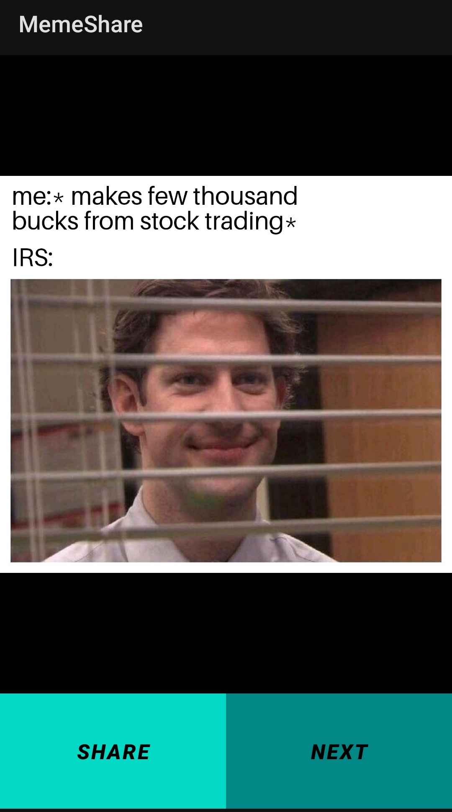

# MemeShare

The MemeShare App is an Android application developed in Kotlin using Android Studio. The app utilizes the Volley library to fetch data from a Reddit API and display memes to the user. It provides two main functionalities: 
1. Navigating to the next meme and 
2. Sharing the URL of the meme.

Key Responsibilities and Achievements:

1. Designed and developed the Meme Sharing App using Kotlin and Android Studio.
2. Integrated the Volley library to facilitate communication with the Reddit API and retrieve meme data.
3. Implemented a user-friendly interface that allows users to navigate through a collection of memes by tapping a "Next" button.
4. Enabled the sharing functionality, allowing users to share the URL of the displayed meme through various social media platforms or messaging apps.

Technologies Used:

1. Kotlin, 
2. Android Studio, 
3. Android SDK, 
4. Volley library for network communication, 
5. Reddit API for fetching meme data

